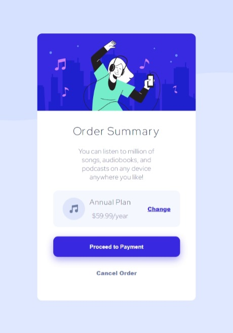

# Frontend Mentor - Order summary card solution

This is a solution to the [Order summary card challenge on Frontend Mentor](https://www.frontendmentor.io/challenges/order-summary-component-QlPmajDUj). Frontend Mentor challenges help you improve your coding skills by building realistic projects. 

## Table of contents

- [Overview](#overview)
  - [The challenge](#the-challenge)
  - [Screenshot](#screenshot)
  - [Links](#links)
- [My process](#my-process)
  - [Built with](#built-with)
  - [What I learned](#what-i-learned)
 
- [Author](#author)
- [Acknowledgments](#acknowledgments)


## Overview

### The challenge
This challenge seeks to make an Order Summary Card Component according to design and requirements provided. <br>
Users should be able to:

- See hover states for interactive elements

### Screenshot

#### Desktop Screenshot


#### Mobile Screenshot



### Links

- Solution URL: [Solution on Front-end mentor](https://www.frontendmentor.io/solutions/ordersummarycomponent-using-html-and-css-sass-xZjHBjFg0)

- Live Site URL: [Live Code](https://my-project-kappa-puce.vercel.app/)

## My process

### Built with

- Semantic HTML5 markup
- CSS (Sass)
- Flexbox

### What I learned
I practiced on html and css especially on :

- Sass.
- Flexbox.

```css
/*proud of this css*/
.plans{
    display: flex;
    align-items: center;
    justify-content: space-between;
    flex-direction: row;
    background-color: $neutral-pale-blue;
    border-radius: 10px;
    width: 80%;
    padding: 10px 20px;
    .plan-data{
        @include flex;
        flex-direction: row;
        .music-icon{
            margin-right: 10px;
        }
        
        .div{
            @include flex;
            flex-direction: column;
        }
    }
}
```


### Continued development

I will focus more on the clean architecture of CSS and Semantic HTML.


### Useful resources

- [W3 schools](https://www.w3schools.com/)
- [MDN](https://developer.mozilla.org/en-US/docs/Web/CSS)

## Author

- Linkedin - [Abdullah Khallaf](https://www.linkedin.com/in/abdullah-khallaf/)
- Frontend Mentor - [@Abdullah-khallaf](https://www.frontendmentor.io/profile/Abdullah-khallaf)
- Twitter - [@abdullahkhalla5](https://www.twitter.com/abdullahkhalla5)

Thank You.
