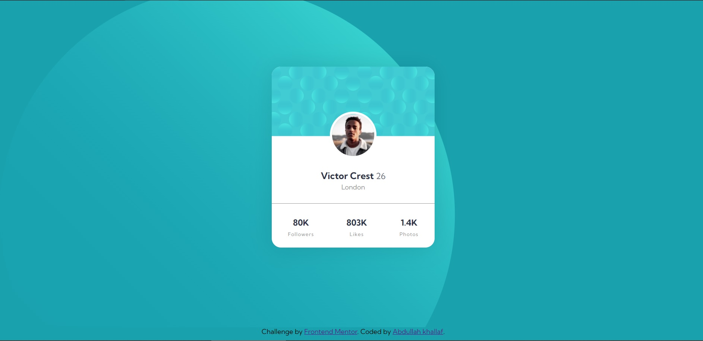
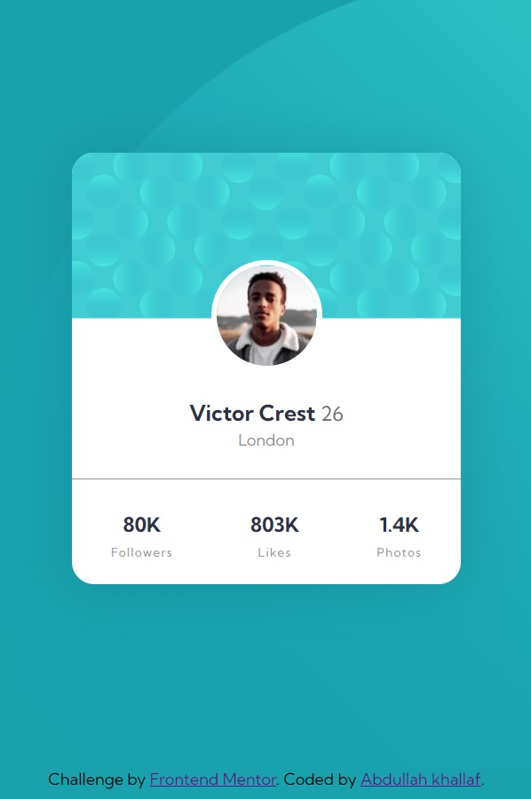

# Frontend Mentor - Profile card Component solution

This is a solution to the [Profile Card Component](https://www.frontendmentor.io/challenges/profile-card-component-cfArpWshJ). Frontend Mentor challenges help you improve your coding skills by building realistic projects. 

## Table of contents

- [Overview](#overview)
  - [The challenge](#the-challenge)
  - [Screenshot](#screenshot)
  - [Links](#links)
- [My process](#my-process)
  - [Built with](#built-with)
  - [What I learned](#what-i-learned)
 
- [Author](#author)
- [Acknowledgments](#acknowledgments)


## Overview

### The challenge
This challenge seeks to make Profile card Component according to design and requirements provided. <br>

### Screenshot

#### Desktop Screenshot


#### mobile Screenshot



### Links

- Solution URL: [Solution on Front-end mentor](https://www.frontendmentor.io/solutions/css-profile-card-component--CJWyZGiF)

- Live Site URL: [Live Code](https://my-project-beta-drab.vercel.app/)

## My process

### Built with

- HTML5 markup.
- CSS.
- Flexbox.

### What I learned
I practiced on html and css especially on :

- CSS Variables.
- BEM Classes Naming Methodology>
```html
<!--proud of this html-->*/
<div class="card__body">
          <div class="image-box">
            
          </div>
          <div class="personal">
            <h2 class="personal__name-age">
              Victor Crest
              <span class="age">
                26
              </span>
            </h2>
            <span class="personal__location">
              London
            </span>
          </div>
</div>

```
### Continued development

I will focus more on the clean architecture of CSS and Semantic HTML.


### Useful resources

- [W3 schools](https://www.w3schools.com/)
- [MDN](https://developer.mozilla.org/en-US/docs/Web/CSS)
- [BEM](http://getbem.com/introduction/)

## Author

- Linkedin - [Abdullah Khallaf](https://www.linkedin.com/in/abdullah-khallaf/)

- Frontend Mentor - [@Abdullah-khallaf](https://www.frontendmentor.io/profile/Abdullah-khallaf)

- Twitter - [@abdullahkhalla5](https://www.twitter.com/abdullahkhalla5)

Thank You.
